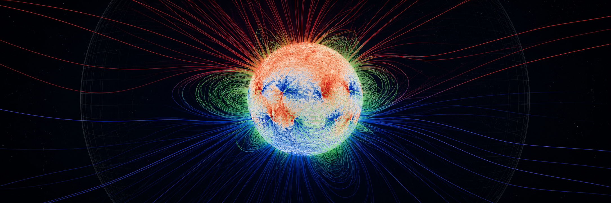
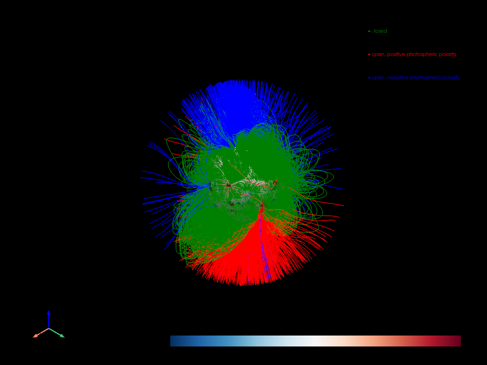

# SPAC-Viz

**Solar PFSS Analysis and Classification visualization toolkit**

[](https://github.com/thepeteriley/SPAC-Viz/actions/workflows/tests.yml)
[](https://www.python.org/)
[](LICENSE)



SPAC-Viz turns ADAPT photospheric magnetic maps into reproducible potential-field
source-surface (PFSS) solutions, classified three-dimensional field lines,
PyVista visualisations, and strict Digistar VLA geometry. It is designed for
large scientific runs: tracing is chunked, checkpointed, and resumable.

## Highlights

- Loads a specific ADAPT ensemble realisation or the pixelwise ensemble mean.
- Downloads the latest or time-nearest Carrington-centred ADAPT product.
- Converts native ADAPT CAR maps to the CEA grid required by maintained
  `sunkit_magex.pfss`.
- Traces every seed bidirectionally with maintained sunkit-magex tracers.
- Classifies lines as closed, positive-open, negative-open, or unresolved.
- Deterministically cleans, orients, and geometrically deduplicates results.
- Builds an interactive PyVista scene with the ADAPT map at `1 R_sun`.
- Exports three class-specific Digistar P/L ASCII files in approved D4 format.

## Installation

SPAC-Viz supports Python 3.11 and 3.12. Python 3.12 is the most thoroughly
tested version.

### Virtual environment

```bash
git clone https://github.com/thepeteriley/SPAC-Viz.git
cd SPAC-Viz
python3.12 -m venv .venv
source .venv/bin/activate       # Windows PowerShell: .venv\Scripts\Activate.ps1
python -m pip install --upgrade pip
python -m pip install -e .
```

Install test dependencies for development:

```bash
python -m pip install -e '.[test]'
```

### Conda or Mamba

```bash
mamba env create -f environment.yml
conda activate spac-viz
python -m pip install -e . --no-deps
```

The exact versions used for the latest verified environment are recorded in
[`tested-environment.txt`](tested-environment.txt).

## Quick start

Use a local ADAPT FITS ensemble:

```bash
spac-viz \
  --adapt-file /path/to/adapt_map.fts.gz \
  --realization 0 \
  --plot \
  --export-vla \
  --output-dir output_2deg
```

Or fetch the newest available Carrington-centred ADAPT map:

```bash
spac-viz --download-latest --realization 0 --plot --output-dir output_latest
```

The source checkout can also be run without installing the console command:

```bash
python -m spac_viz --adapt-file /path/to/adapt_map.fts.gz --realization mean
```

The default run uses a 2° photospheric seed grid (16,200 seeds), `rss=2.5`,
`nrho=60`, and no source-surface seed grid. Each seed is already traced in both
directions. Add `--outer-seeds` only when extra source-surface coverage is
scientifically desired.

## Common workflows

### Save a visualisation and Digistar files

```bash
spac-viz \
  --adapt-file /path/to/adapt_map.fts.gz \
  --realization 0 \
  --plot \
  --save-screenshot output_2deg/pfss.png \
  --save-pyvista output_2deg/pfss_scene.vtp \
  --export-vla \
  --output-dir output_2deg
```

### Resume an interrupted trace

```bash
spac-viz \
  --adapt-file /path/to/adapt_map.fts.gz \
  --realization 0 \
  --resume \
  --export-vla \
  --output-dir output_2deg
```

Resume requires exactly the same scientific and tracing configuration. A
different map, realization, spacing, PFSS grid, tracer setting, or outer-seed
choice requires a new output directory.

### High-resolution dual-boundary run

```bash
spac-viz \
  --download-latest \
  --realization 0 \
  --surface-spacing-deg 1 \
  --outer-spacing-deg 1 \
  --outer-seeds \
  --trace-chunk-size 1000 \
  --resume \
  --export-vla \
  --output-dir output_full_1deg
```

Two 1° grids contain 129,600 seeds and can require substantial CPU time, RAM,
and disk space. SPAC-Viz does not subsample them.

Run `spac-viz --help` for every option. See the [CLI guide](docs/CLI.md) for
input selection, visualisation controls, checkpoint behaviour, and output files.

## Visualisation and classification



- **Green:** closed lines whose two endpoints reach the photosphere.
- **Red:** open lines with positive radial field at the photospheric endpoint.
- **Blue:** open lines with negative radial field at the photospheric endpoint.
- **Unresolved:** invalid endpoint combinations or values within the configured
  zero threshold; these are reported but not exported.

The outer source surface is not a magnetic map. Its optional display is only a
neutral wireframe enabled by `--show-source-surface`. Use
`--field-lines-only` to remove every surface.

## Output layout

```text
OUTPUT_DIRECTORY/
├── checkpoints/                       # atomic resumable trace chunks
├── trace_results.npz                  # consolidated classified geometry
├── summary.json                       # configuration and class counts
├── pfss_blue_open_negative.vla        # assign blue in Digistar
├── pfss_green_closed.vla              # assign green in Digistar
└── pfss_red_open_positive.vla         # assign red in Digistar
```

Screenshots and VTP scenes are produced only when requested. Existing results
are protected unless `--overwrite` is explicitly supplied.

## Digistar coordinate convention

Scientific coordinates remain right-handed `(X, Y, Z)`. VLA export writes
input-axis order `(X, Z, Y)` together with `set coordsys LEFT`. Classic VLA
does not encode RGB, so colours are class labels in filenames and must be
assigned to the three objects in Digistar. No intensity directive or intensity
records are emitted.

## Scientific assumptions

PFSS assumes a static, current-free corona between the photosphere and a
spherical radial-field source surface. It cannot represent currents,
eruptions, time evolution, or a non-spherical source surface. Results depend on
the selected magnetogram, ADAPT realisation, seed grid, PFSS resolution, and
source-surface radius. See [Scientific notes](docs/SCIENTIFIC_NOTES.md).

## Development

```bash
SUNPY_CONFIGDIR=.sunpy-config \
SUNPY_DOWNLOADDIR=.sunpy-data \
MPLCONFIGDIR=.mpl-config \
XDG_CACHE_HOME=.cache \
PYVISTA_OFF_SCREEN=true \
python -m pytest -q
```

Network tests are opt-in:

```bash
RUN_NETWORK_TESTS=1 python -m pytest -m network
```

See [CONTRIBUTING.md](CONTRIBUTING.md), [SECURITY.md](SECURITY.md), and the
[changelog](CHANGELOG.md) before contributing.

## ADAPT acknowledgement

> This work utilises data produced collaboratively between Air Force Research
> Laboratory (AFRL) & the National Solar Observatory (NSO). The ADAPT model
> development is supported by AFRL. The input data utilised by ADAPT is obtained
> by NSO/NISP (NSO Integrated Synoptic Program). NSO is operated by the
> Association of Universities for Research in Astronomy (AURA), Inc., under a
> cooperative agreement with the National Science Foundation (NSF).

## Citation and license

If SPAC-Viz contributes to published work, cite the software using
[`CITATION.cff`](CITATION.cff) and acknowledge the underlying ADAPT data as
shown above. SPAC-Viz is available under the [MIT License](LICENSE).
